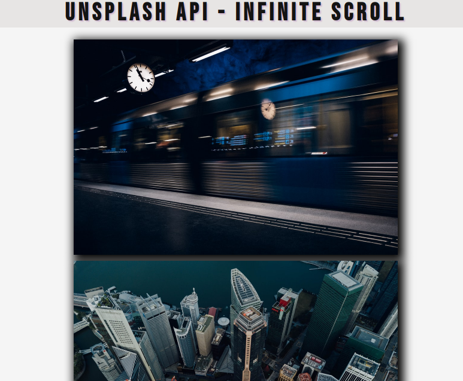

# infinity Scroll

This page an infinity scroll design, this page use some logic to make a picture scroll infinitly.The project has been an exercise of using javascript to manipulate the dom and fetching an api using fetch() function from the window object. the main purpose of this project has been to build a user interactive page to aquire further practice on using javascript to manipulate the dom.

## Built With

- HTML5
- CSS3
- JAVASCRIPT

## Live Demo

Live link here: https://ignatius22.github.io/infinity-scroll/

## Author

👤 **Author**
Ignatius Sani:
- Github: https://github.com/ignatius22 
- Linkedin: https://www.linkedin.com/in/ignatiussani  
